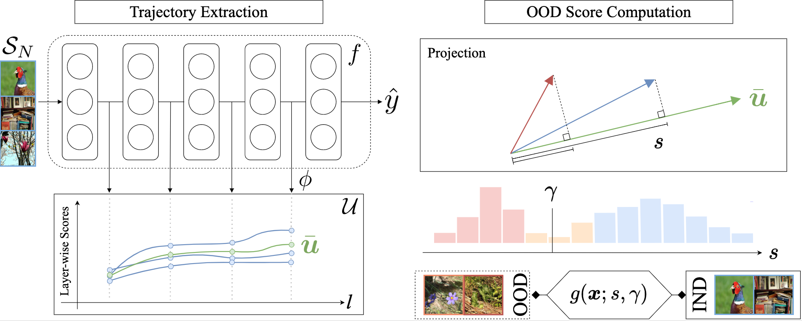

<h1 align="center">
A Functional Data Perspective and Baseline on Multi-Layer Out-of-Distribution Detection
</h1>

Adapted from the OOD detection library [detectors](https://www.github.com/edadaltocg/detectors).

[Arxiv link](https://arxiv.org/abs/2306.03522).



Fig 1. The left-hand side shows the mapping of the hidden representations of an input sample into a functional representation. Then, during test time, we compute the OOD score $s$ of a sample. A threshold $\gamma$ is set to obtain a binary discriminator $g$.

## Requirements

To reproduce the results, you will need to install the following packages:

- Python 3.8+
- torch >= 1.11.0
- torchvision

And additional requirements. Please run `pip install -r requirements.txt` to install them.

## Usage

```python
import src
import torch


device = torch.device("cuda" if torch.cuda.is_available() else "cpu")
model = src.create_model("resnet50", pretrained=True)
model = model.to(device)
test_transform = src.create_transform(model)

pipeline = src.create_pipeline("ood_benchmark_imagenet", transform=test_transform)
method = src.create_detector("msp", model=model)

pipeline_results = pipeline.run(method)
print(pipeline.report(pipeline_results["results"]))
```

## Our Method

In a simplified way, our method consists of the following steps:

1. OOD layer-wise score

```python
import torch
from torch import Tensor


def projection_layer_score(x: Tensor, mus: Tensor, eps=1e-7):
    # efficient cosine similarity
    num = x @ mus.T
    den = torch.norm(x, dim=-1, keepdim=True) @ torch.norm(mus, dim=-1, keepdim=True).T
    stack = num / (den + eps)
    # multiply by norm
    return torch.norm(x, p=2, dim=-1, keepdim=True) * stack


class LayerWiseProjectionScore:
    def __init__(self):
        self.mus = None

    def fit(self, X: Tensor, labels: Tensor):
        self.mus = []
        unique_classes = torch.unique(labels).detach().cpu().numpy().tolist()
        for c in unique_classes:
            filt = labels == c
            if filt.sum() == 0:
                continue
            self.mus.append(X[filt].mean(0, keepdim=True))
        self.mus = torch.vstack(self.mus)

    def __call__(self, x: Tensor, probs: Tensor):
        scores = torch.norm(x, p=2, dim=-1, keepdim=True) * projection_layer_score(x, self.mus.to(x.device))
        return torch.sum(probs * scores, dim=-1, keepdim=True)
```

2. Score aggregation

```python
import numpy as np


class InnerProductAggregation:
    def __init__(self) -> None:
        self.mean = None
        self.max_ = None

    def fit(self, training_trajectories: np.ndarray):
        self.max_ = np.max(training_trajectories, axis=0)
        training_trajectories = training_trajectories / self.max_
        self.mean = np.mean(training_trajectories, axis=0, keepdims=True)

    def __call__(self, test_trajectory: np.ndarray):
        test_trajectory = test_trajectory / self.max_
        return np.inner(test_trajectory, self.mean).reshape(-1) / np.sum(self.mean**2)
```

### (Optional) Environmental Variables

Please, place the following lines in your `.env` file if you want to modify any of the default folders.

```bash
#.env
export DATA_DIR="storage/"
export CHECKPOINTS_DIR="checkpoints/"
export RESULTS_DIR="results/"
```

## Citation

```
``
